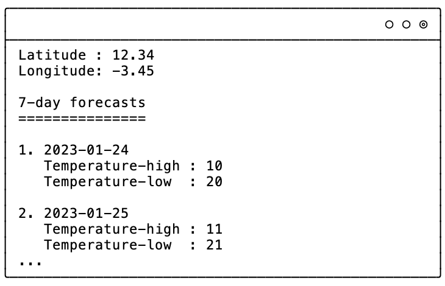
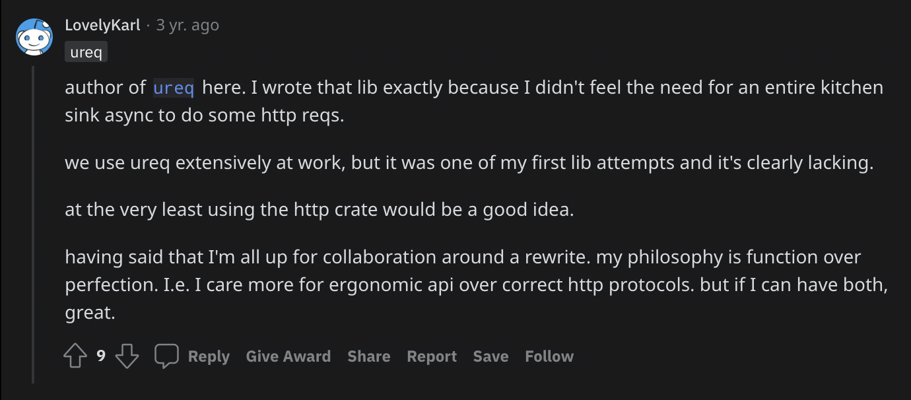
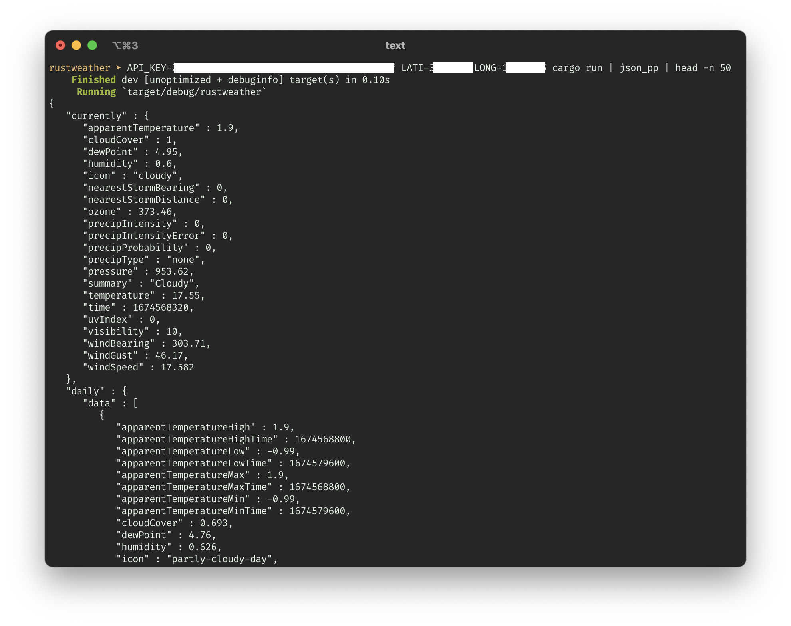

# I learn rust

I will be sharing my first attempt of learning rust as I develop a simple program.
I hope that this will be an interesting and enlightening one, at least for me (🤞).

I want to challenge myself and truly understand the language, so I refrain from using any AI-assistive tools (such as copilot and ChatGPT), to ensure that I am fully immersed in the process.

> As a side note:
> I have prior knowledge in other programming languages, and I have knowledge in memory management or languages with memory management like C.
> I also did some basic rust tutorial (especially on borrow checking and basic language constructs) before writing this article.


## Weather forecast app

I will start by creating a weather forecast app that fetches data from a provider.
This app will be a Command Line Interface (CLI) program that accepts input for latitude and longitude.
It will then use that information to fetch the forecast from an existing forecast API provider.
The app will be designed to get daily forecast (date and foreasted temperature), which will be displayed to the user.
I want to learn how to work with APIs (especially HTTP request) and how to handle user input in rust.
It will also be a good opportunity to work with rust's powerful error handling capabilities.

Roughly, this is the result I expected:

<p>

</p>

## Implementation

Recently, while browsing through hackernews' front page, I came across a website called [pirateweather](https://pirateweather.net/).
This website provides a simple API that allows developers to access weather forecast data.
I was intrigued by the service, so I decided to check it out.
After taking a closer look, I was pleased to find that the API is quite simple to use.
All I need to do is sign up for an API key, and I will be able to access the forecast data via HTTP request.

However, the first question is...


#### How to make HTTP request in rust?

When it came to making HTTP requests in rust, I initially had no idea where to start.
I did some google search and found that many developers suggested using libraries such as `tokio` and `reqwest`.
However, I didn't want to install too many libraries for such a simple task such as HTTP GET request.
My gut feeling was that these libraries might be overkill for what I needed.

Fortunately, I stumbled across a reddit discussion that mentioned `ureq` by the author himself.

 

After taking a closer look at the library, I found that it is very simple and easy to use.
I decided to give it a try.

Long story short, This is my current starter code.


```rust
use ureq;

struct WeatherApp {
    api_key: String,
}

impl WeatherApp {
    fn new(api_key: String) -> Self {
        Self { api_key }
    }

    fn fetch(self, lat: f64, long: f64) -> Result<String, ureq::Error> {
        // TODO: return a proper result. Should be an array of struct of frecast result (or
        // something else deemed proper)
        let body: String = ureq::get("https://www.example.com").call()?.into_string()?;
        Ok(body)
    }
}

fn main() {
    let api_key: String;

    // I don't want to censor every single snippet ;)
    match std::env::var("API_KEY") {
        Ok(result) => api_key = result,
        Err(err) => panic!("{}", err),
    }

    let app = WeatherApp::new(api_key);
    let result = app.fetch(0.0, 0.0);
    match result {
        Ok(result) => println!("{}", result),
        Err(err) => println!("{}", err),
    }
}
```

The code wraps the main app as a struct, which has a method called `fetch` that accepts latitude and longitude as inputs.
For now, this method practically does nothing other than fetching the website [www.example.com](www.example.com) and returning the response as a string.
Not useful at all, I know, but it's a good starting point to build upon.

Fixing the link to the proper API endpoint is as easy as it is mentioned in the API documentation.
I decided to keep the API key as an environment variable, but the latitude and longitude should be user-defined.

The next question arises ... 

#### How to get user input?

It turns out that getting user input in rust is quite easy.
First, I declared `String` variable to hold the latitude and longitude values.
Then, I instantiated `io::stdin` with which I can invoke the `read_line()` method to accept string input from the user.
This method allows me to read user input and store it in the String variable.
Now, I have a way to get user input and I can use it in my fetch method to get the forecast data for the location specified by the user.

```rust
...

    let stdin = io::stdin();
    let mut lat = String::new();
    match stdin.read_line(&mut lat) {
        Ok(_) => (),
        Err(err) => panic!("{}", err),
    }

    let mut long = String::new();
    match stdin.read_line(&mut long) {
        Ok(_) => (),
        Err(err) => panic!("{}", err),
    }

...

```

I immediately found that no need to use floating number for latitude and longitude as the `fetch()` arguments.
I also refactor the code to reduce repetition.
Now, following is the updated code:


<div class="toggle">

```rust 
use std::io::{self, Write};

use ureq;

struct WeatherApp {
    api_key: String,
}

impl WeatherApp {
    fn new(api_key: String) -> Self {
        Self { api_key }
    }

    fn fetch(self, lat: String, long: String) -> Result<String, ureq::Error> {
        let url = format!(
            "https://api.pirateweather.net/forecast/{}/{},{}",
            self.api_key, lat, long
        );
        let body: String = ureq::get(&url).call()?.into_string()?;
        Ok(body)
    }
}

// Ask for user input for latitude and longitude
fn input_latilong() -> (String, String) {
    let mut lati: String = "".to_owned();
    let mut long: String = "".to_owned();

    print!("Enter latitude: ");
    io::stdout().flush().unwrap();
    let stdin = io::stdin();
    match stdin.read_line(&mut lati) {
        Ok(_) => (),
        Err(err) => panic!("{}", err),
    }

    print!("Enter longitude: ");
    io::stdout().flush().unwrap();
    match stdin.read_line(&mut long) {
        Ok(_) => (),
        Err(err) => panic!("{}", err),
    }

    (lati, long)
}


// Helper to get environment variable. Return empty string on failure.
fn get_env(key: &str) -> String {
    match std::env::var(key) {
        Ok(result) => result,
        Err(_) => "".to_owned(),
    }
}

fn main() {
    let api_key: String;

    // I don't want to censor every single snippet, and API_KEY seems better to be an os
    // environment variable. Must panic when it is not set.
    match std::env::var("API_KEY") {
        Ok(result) => api_key = result,
        Err(err) => panic!("{}", err),
    }

    // I also don't want to input over and over during testing, so I also utilize environment
    // variables
    let mut lati = get_env("LATI");
    let mut long = get_env("LONG");

    // If lati or long is not set then ask for user input
    if lati == "" || long == "" {
        (lati, long) = input_latilong();
    }

    let app = WeatherApp::new(api_key);

    let fetch_result = app.fetch(lati, long);
    match fetch_result {
        Ok(result) => println!("{}", result),
        Err(err) => println!("{}", err),
    }
}
```

</div>

I learned that `to_string()` is a generic conversion to a String from any type implementing the `ToString` trait.
In most cases, we can just use `to_owned()` on a string to keep it alive, rather than `to_string()`.

And this is what I get when running the program.



Nice.

Suppose that string is decoded into a JSON object `obj`, then what I need to do is extracting a list of forecast in `obj["daily"]["data"]`.
To do that, what I need to do is to decode that JSON string, and get the object that I want.

Next question is...

#### How to decode JSON string?

First google search result directed me to a library called `serde-json`.
It seems pretty popular.
This is how I used `serde-json` to decode HTTP response from `ureq`.

```rust 
...
        let body: String = ureq::get(&url).call()?.into_string()?;
        let v: Value = serde_json::from_str(&body).expect("Error parsing forecast JSON format");
...
```

he second line is using the `from_str()` method provided by the `serde_json` library to parse the string into a Value struct from the `serde_json` library which is able to hold any JSON value.
This struct can be queried for fields using the [] operator.

It is worth mentioning that the `expect("Error parsing forecast JSON format")` method is used to handle the error that may occur during parsing the json string, it will panic and print the error message passed to it in case of failure.
It is a bit crude as it is not a recommended way for handling errors in rust, but I will get back to this later.

At this point, I can return the forecast results as a vector of `Forecast` struct. 
I refactored the code as follows.

<div class="toggle">

```rust 
...

struct Forecast {
    time: u64,
    temperature_high: f64,
    temperature_low: f64,
}

...

impl WeatherApp {

    ...

    fn fetch(self, lat: String, long: String) -> Result<Vec<Forecast>, ureq::Error> {
        let url = format!(
            "https://api.pirateweather.net/forecast/{}/{},{}?units=si",
            self.api_key, lat, long
        );
        let body: String = ureq::get(&url).call()?.into_string()?;
        let v: Value = serde_json::from_str(&body).expect("Error parsing forecast JSON format");

        let mut result: Vec<Forecast> = Vec::new();
        if let Some(forecasts) = v["daily"]["data"].as_array() {
            for forecast in forecasts {
                result.push(Forecast {
                    time: forecast["time"].as_u64().expect("cannot parse `time`"),
                    temperature_low: forecast["temperatureLow"]
                        .as_f64()
                        .expect("cannot parse `temperatureLow`"),
                    temperature_high: forecast["temperatureHigh"]
                        .as_f64()
                        .expect("cannot parse `temperatureHigh`"),
                })
            }
        }

        Ok(result)
    }
}
```

</div>

Yep. Seems we are in the right direction, except that according to the documentation, the time is in UNIX timestamp format.
I want it as a human-readable date format.

The problem is...

#### How to parse date and time from a UNIX timestamp?


### Returning a "list" of forecast? In what?

Naturally, I know that I want to use something like array.
I found that rust also has `Vector`, i.e., "dynamic"/"growable" array.

## Recap

In this session, I learned several things:

- Performing HTTP request 
- Getting user inputs 
- Deserializing JSON string 
- Parsing date and time 

## Impression 

Rust is a nicely designed language and I have been enjoying working with it.
As soon as I deal with borrow checker successfully (and gracefully), I become more confident that my program will run correctly.
However, I still feel like there is more to learn, as many concepts in Rust are still not covered, such as lifetime, concurrency, macros, unsafe rust, and more advanced data types.
While this is just a simple program, I know that rust has a lot more to offer.
I am looking forward to trying more complex case studies in the future, to get a better understanding of the language and its capabilities.

