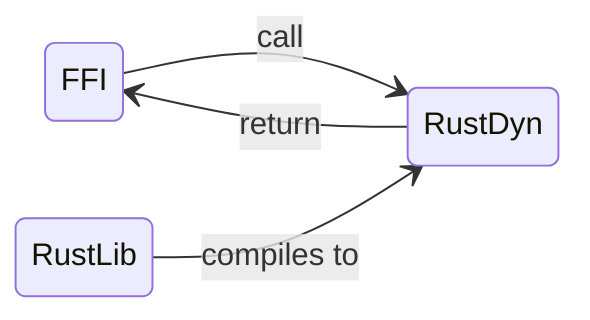

# An attempt to use Polars in Go

> Or, my easy way to expose rust functions as a shared library

[Polars]() is an aweseome dataframe library. It is very fast and feature-rich.

Unfortunately, at the time this article is written, the official frontend language is limited to Python and Rust itself.

## The plan

C has become the de facto _lingua franca_ of programming due to its ability to compile to a shared library.
Anything written in a language that compiles to C can be exposed to the outside world.




## Exposing a simple rust function

`cargo init --lib .`

### Simple function

```rust
#[no_mangle]
pub extern "C" fn add(a: i32, b: i32) -> i32 {
    a + b
}
```

After `cargo build -r`, inside directory `target/release/` we will see `libmylib.dylib` file (or `libmylib.so` or `libmylib.dll` if we're on linux or windows respectively).

Go has its own FFI called `cgo` for interoperability with C.
Below is how we call `add` function from Go.

```go
package main

/*

// Our rust library output after "cargo build" will be in ./target/release.
// The "-lmylib" follows "libmylib.{so, dylib}" name.
#cgo LDFLAGS: -L./target/release -lmylib

int add(int a, int b);

*/
import "C"
import (
	"fmt"
	"unsafe"
)

func main() {
	result := C.add(C.int(2), C.int(3))
	fmt.Println(result)
}
```

## What about a more complex structure?


```rust
pub struct Vec2d {
    x: i32,
    y: i32,
}
```

We don't need to care about rust-to-C struct mapping, really.
If we want to create a `Vec2d` in Go, we can just create a function in rust that returns a raw pointer to the newly created `Vec2d`, then call that function in Go.
See below snippet.

```rust
// Just return a raw pointer on heap-allocated Vec2d
#[no_mangle]
pub extern "C" fn new_vec2d(x: i32, y: i32)->*mut Vec2d {
    let v = Vec2d{x, y};
    Box::into_raw(Box::new(v))
}
```

We need to print string representation of `Vec2d`, so we implement `Display` trait for it.
With this, we can make a function to "convert" `Vec2d` into a C-string representation.

```rust
impl Display for Vec2d {
    fn fmt(&self, f: &mut std::fmt::Formatter<'_>) -> std::fmt::Result {
        write!(f, "Vec2(x: {}, y: {})", self.x, self.y)
    }
}

#[no_mangle]
pub extern "C" fn vec2d_to_cstring(v: *mut Vec2d) -> *const c_char {
    let v = unsafe { &*(&*v).borrow() };
    let str = v.to_string();
    CString::new(str).unwrap().into_raw()
}
```

```go
package main

/*
#cgo LDFLAGS: -L./target/release -lmylib

void* new_vec2d(int x, int y);
char* vec2d_to_cstring(void* v);
*/
import "C"
import (
	"fmt"
)

func main() {
    // now v has a handle for Vec2d raw pointer, which is unsafe
	v := C.new_vec2d(2, 3)
	fmt.Println(C.GoString(C.vec2d_to_cstring(v)))
}
```

My preferred way to deal with C-interop is to use *indirection*, i.e., wrapping unsafe codes inside safe abstraction.
For example, we create a Go struct for `Vec2d` that holds attribute `data` pointing to the actual raw pointer. 
We also add a function to instantiate the `Vec2d` as well as to get string representation (i.e., for printing, etc.).

```go
/*
#cgo LDFLAGS: -L./target/release -lmylib

void* new_vec2d(int x, int y);
char* vec2d_to_cstring(void* v);
*/
import "C"
import (
	"fmt"
	"unsafe"
)

type Vec2 struct {
	// storing pointer to rust's actual Vec2d struct
	data unsafe.Pointer
}

func NewVec2D(x int, y int) Vec2 {
	return Vec2{
		data: C.new_vec2d(C.int(x), C.int(y)),
	}
}

func (v Vec2) String() string {
	return C.GoString(C.vec2d_to_cstring(v.data))
}

func main() {
	v := NewVec2D(5, 6)
	fmt.Println(v)
}
```