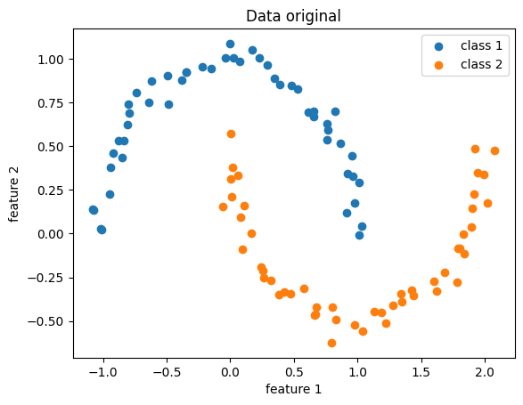
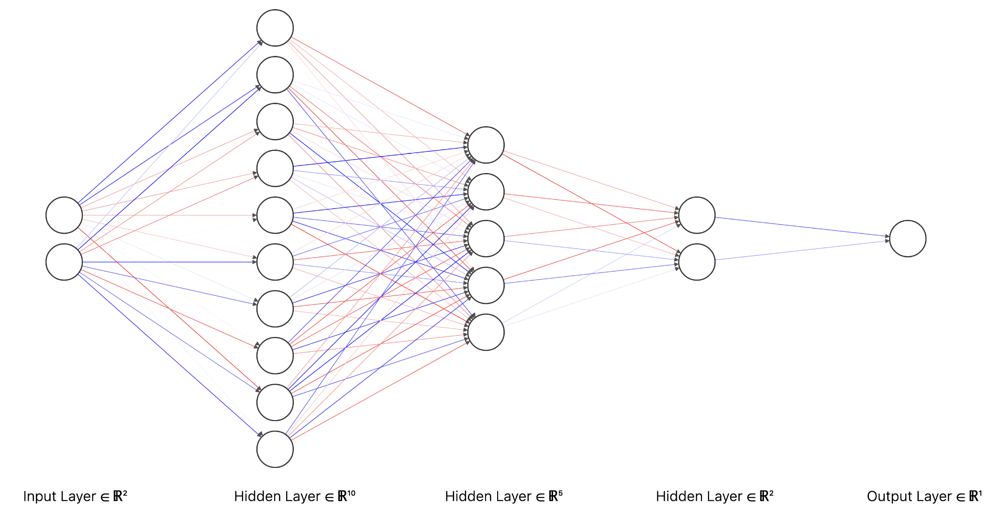
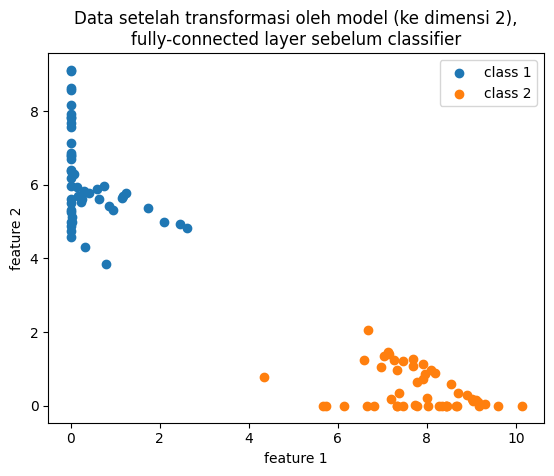

# Tentang *representation learning* pada *neural network classifier*

Layer terakhir *neural network* untuk klasifikasi biasanya berupa *sigmoid* (untuk *binary classification*) atau *softmax* (untuk *multi-class classification*). Keduanya adalah fungsi yang jika digunakan sebagai classifier, akan menghasilkan *linear decision boundary*. 

Maksudnya bagaimana? 

Misalkan kita memiliki sekumpulan data berdimensi dua (memiliki dua feature) dari dua kategori. Jika divisualisasikan sebagai titik-titik pada diagram kartesius terhadap sumbu $x$ dan $y$, akan nampak dua gerombolan. Titik-titik dengan kategori yang sama akan saling berdekatan. Titik-titik dengan kategori berbeda akan saling menjauh. *Classifier* dengan *linear decision boundary* akan memisahkan dua kelompok pada data-data tersebut berdasarkan dengan satu garis lurus. 

<p style="text-align:center">

<p class="caption">Data yang <i>linearly-separable</i> (<a href src="https://en.wikipedia.org/wiki/Linear_separability">sumber gambar</a>)</p>
</p>

> Jika data berdimensi 3 atau lebih, "garis" pemisah ini disebut *hyperplane*. Apabila dimensi data lebih dari 3, data dan hyperplane akan sulit divisualisasikan, namun konsep "garis" lurus pemisah tetap berlaku di dimensi tinggi.
> 
> <p class="caption">linear separability pada data berdimensi 3 (<a href src="https://appliedmachinelearning.files.wordpress.com/2017/03/svm_logo1.png">sumber gambar</a>)</p>


Perlu kita ingat bahwa *neural network* termasyhur digunakan untuk mengklasifikasikan data yang kompleks (gambar, video, teks), berdimensi tinggi, dan tentunya, hubungan data-data baik dalam-kelas maupun antar-kelasnya **sangat tidak linear**. Lantas, bagaimana bisa fungsi seperti *sigmoid* atau *softmax* mampu mengklasifikasikan data yang tidak linear? 

## *Neural network* adalah soal *representation learning*

Isu utama dalam melatih *neural network* sebetulnya adalah soal bagaimana membuat ia bisa mempelajari **representasi data** dengan baik. Representasi data yang bagaimana? Dalam konteks klasifikasi, representasi data yang kategori elemen-elemennya dapat dipisahkan dengan mudah. Misalnya, dapat dipisahkan cukup dengan garis lurus. 

Pertama, mari kita membuat data sintetik yang tidak *linearly-separable*, misalnya dataset `moon`:

```python
from sklearn.datasets import make_moons

x, y = make_moons(noise=.05)
```

<p style="text-align:center">

</p>
<p class="caption">Data demonstrasi, original</p>

Tidak ada garis lurus yang dengan baik memisahkan kedua kategori di atas. 

Kemudian kita mendefinisikan model *neural network* yang strukturnya sederhana saja: serangkaian *fully-connected layer* (*linear layer* yang diikuti oleh *nonlinear activation function*) dan berakhir dengan *classification layer*. 


<p class="caption">Arsitektur neural network</p>

Untuk mempermudah demonstrasi, model kita pecah menjadi dua bagian: *encoder* dan *classifier*. 
Output dari encoder inilah yang kita maksud dengan representasi data yang (harapannya) *linearly-separable*. Seperti biasa, representasi ini akan dimasukkan ke *classifier* untuk proses klasifikasi.

```python
x = torch.FloatTensor(x)
y = torch.FloatTensor(y.reshape(-1, 1))

# Transformasi data dari dimensi 2 ke dimensi 10 -> 5 -> 2.
# Dimensi 2 dipilih untuk mempermudah visualisasi saja.
encoder = Sequential(
    # Hidden layer 1
    LazyLinear(10),
    ReLU(),
  
    # Hidden layer 2
    LazyLinear(5),
    ReLU(),

    # Hidden layer 3
    LazyLinear(2),
    ReLU(),
)

# Transformasi data ke dimensi 1 untuk binary classification
classifier = Sequential(
    LazyLinear(1),
    Sigmoid()
)
```

Kemudian kita latih model seperti biasa dengan menggunakan kriteria loss *binary cross-entropy*:

```python
opt = Adam([*encoder.parameters(), *classifier.parameters()], lr=0.01)
loss_fn = BCELoss()

for _ in range(300):
  opt.zero_grad()

  hidden = encoder(x)  # hidden layer 3, terakhir sebelum klasifikasi
  y_pred = classifier(hidden)  # probability estimate

  loss = loss_fn(y_pred, y)
  loss.backward()

  opt.step()
```

Mari kita coba *pass* data `x` ke encoder dan visualisasikan hasilnya.

```python
hidden = hidden.detach().numpy()
y = y.detach().numpy().ravel()

plt.scatter(*hidden[y==0].T, label="class 1")
plt.scatter(*hidden[y==1].T, label="class 2")
```

<p style="text-align:center">

</p>
<p class="caption">Transformasi oleh encoder yang sudah dilatih</p>

Sekarang, kita dapat dengan mudah menarik garis lurus yang memisahkan dua kategori di atas, dan mudah saja bagi classifier untuk membedakannya. Bagaimana bisa demikian? 

## Seperti memisahkan gumpalan dua kertas

Pada *neural network*, kita bisa menganalogikan persoalan *binary classfication* dengan memisahkan dua kertas (hitam dan putih) yang diremas-remas menjadi satu gumpalan. Kita akan mencoba secara berulang-ulang:

- Angkat, putar-putar gumpalannya, perhatikan berbagai sisi (analogi: *linear layer*). Kemudian coba buat tekukan-tekukan kecil (analogi: fungsi nonlinear ReLU) dengan harapan keduanya terlepas. Ternyata upaya pertama (analogi: *hidden layer* pertama) belum berhasil. 
- Lakukan lagi: putar-putar, angkat, tekuk-tekuk (*linear layer* + ReLU yang kedua). 
- Belum bisa dipisahkan? Coba lagi (*linear layer* + ReLU yang ketiga). Akhirnya keduanya bisa dipisahkan.
- Jika sekarang ada seseorang yang meminta kertas putih, kita tinggal ambil kertas putih yang sudah dipisahkan dan berikan pada orang itu (*classification layer*).

Komponen penting dari proses ini adalah *nonlinear layer*. Dengan melibatkan *nonlinear layer*, kita bisa mentransformasikan data yang kompleks menjadi lebih sederhana (lebih dari sekadar translasi, rotasi, dan *scaling*). Sangat sulit, bahkan tidak mungkin, untuk memperoleh representasi sederhana hanya dengan bermodal *linear layer*. Pada analogi di atas, jika kita cuma mengangkat dan memutar-mutar saja, gumpalan tetaplah gumpalan, dan tidak ada upaya mengubah bentuk.

## Kesimpulan

Input untuk *neural network* memang sering kali kompleks. Namun, *neural network* akan mencoba untuk mempelajari representasi melalui sederet transformasi linear dan nonlinear, sedemikian hingga hasil transformasi akan kian mudah digunakan untuk menyelesaikan persoalan (misalnya klasifikasi). Semakin ke belakang suatu hidden layer (mendekati *output layer*), semakin mudah ia digunakan oleh model. Tentu saja tidak ada layer yang berdiri sendiri. Seluruh bagian *neural network* bekerja sebagai satu kesatuan dalam hal *representation learning* ini.

## Kode selengkapnya

<div class="toggle">

```python
import random

import matplotlib.pyplot as plt
import numpy as np
import torch
from sklearn.datasets import make_moons
from torch.nn import BCELoss, LazyLinear, ReLU, Sequential, Sigmoid
from torch.optim import Adam

# Seed semuanya untuk reproducibility
seed = 1
random.seed(seed)
np.random.seed(seed)
torch.manual_seed(seed)


x, y = make_moons(noise=0.05)

plt.scatter(*x[y == 0].T, label="class 1")
plt.scatter(*x[y == 1].T, label="class 2")
plt.xlabel("feature 1")
plt.ylabel("feature 2")
plt.title("Data original")
plt.legend()
plt.show()


x = torch.FloatTensor(x)
y = torch.FloatTensor(y.reshape(-1, 1))

# Transformasi data dari dimensi 2 ke dimensi 10 -> 5 -> 2.
# Dimensi 2 dipilih untuk mempermudah visualisasi saja.
encoder = Sequential(
    LazyLinear(10),
    ReLU(),
    LazyLinear(5),
    ReLU(),
    LazyLinear(2),
    ReLU(),
)

# Transformasi data ke dimensi 1 untuk binary classification
classifier = Sequential(LazyLinear(1), Sigmoid())

opt = Adam([*encoder.parameters(), *classifier.parameters()], lr=0.01)
loss_fn = BCELoss()

losses = []
for _ in range(300):
    opt.zero_grad()

    hidden = encoder(x)  # full-connected terakhir, sebelum klasifikasi
    y_pred = classifier(hidden)  # probability estimate

    loss = loss_fn(y_pred, y)
    loss.backward()

    opt.step()
    losses.append(loss.item())

hidden = hidden.detach().numpy()
x = x.detach().numpy()
y = y.detach().numpy().ravel()


plt.scatter(*hidden[y == 0].T, label="class 1")
plt.scatter(*hidden[y == 1].T, label="class 2")
plt.xlabel("feature 1")
plt.ylabel("feature 2")
plt.title(
    "Data setelah transformasi oleh model (ke dimensi 2),\nfully-connected layer sebelum classifier"
)
plt.legend()
plt.show()

plt.plot(losses)
plt.xlabel("iterasi")
plt.ylabel("nilai loss (binary cross-entropy)")
plt.show()
```
</div>