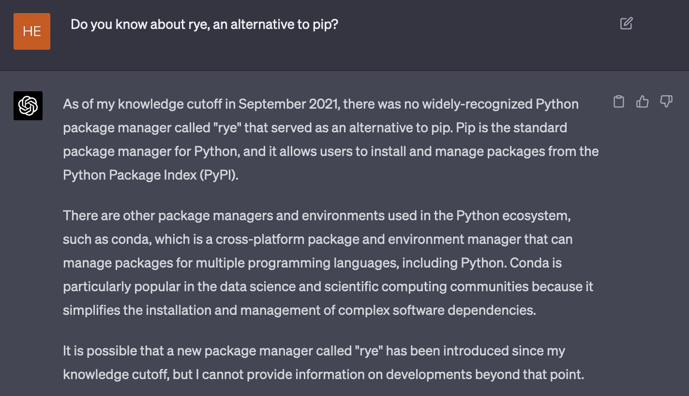

# *LLM*: pengetahuan kedaluarsa dan proses melupakan masa lalu

*Large language model* (LLM) adalah sistem kecerdasan buatan berbasis *machine learning* untuk memahami, menghasilkan, dan memanipulasi bahasa manusia.
Model-model LLM dilatih dengan data tekstual yang sangat besar.
ChatGPT, misalnya, dilatih dengan data dari berbagai sumber seperti wikipedia, situs berita, publikasi ilmiah, media sosial, dsb., hingga September 2021 [^1].
Jika ia ditanya hal yang ada setelah September 2021, dia tidak akan mampu menjawabnya. Kalaupun dia mencoba menjawab, mungkin akan berupa teks omong kosong saja.

Konsekuensinya, beberapa tahun lagi LLM seperti ChatGPT tidak lagi relevan. Ketinggalan zaman.

> Tulisan ini akan lebih banyak membahas ChatGPT.

## LLM perlu diperbarui berkala

Dalam satu bulan barangkali ada puluhan framework/*library* yang diluncurkan, baik yang benar-benar baru maupun yang bersifat revisi.
Bukan tidak mungkin juga akan muncul bahasa pemrograman baru yang menghasilkan proyek-proyek baru.
Jika LLM ingin memiliki wawasan tentang hal-hal tersebut, mau tidak mau pengetahuannya harus diperbarui.
Cara paling kasat mata adalah dengan menerapkan *fine-tuning* dengan memberinya data-data baru.

Pertanyaan selanjutnya, seberapa banyak informasi yang perlu digunakan untuk memperbarui model AI?
Informasi baru di internet muncul dan bertambah secara eksponensial, sementara kapasitas model terbatas.
Penyedia layanan model AI harus menyeleksi informasi apa yang dapat diberikan pada model, dan tugas apa saja yang dapat ia selesaikan dengan baik.
Kapasitas model terbatas, sumberdaya komputasi juga terbatas. LLM tidak akan mampu mengakomodasi kebutuhan tiap kepala manusia di bumi.

## Memperbarui parameter LLM membutuhkan waktu tersendiri dan tidak *real-time*

Salah satu miskonsepsi adalah bahwa ChatGPT memperbarui pengetahuannya saat melakukan obrolan dengan pengguna.

Tidak.

Saat kita mengobrol dengan ChatGPT, dia tidak memperbarui parameternya saat itu juga.
Yang terjadi sebenarnya adalah, ChatGPT menyimpan konteks sementara untuk satu sesi.
Dia mungkin akan tetap *nyambung* dengan obrolan kita, namun dalam batasan tertentu.
Hingga ChatGPT versi *engine* GPT-4, konteks yang dapat disimpan sementara dalam satu sesi adalah sekitar 4096 token [^1].

> Satu token bisa berupa kata atau beberapa karakter dalam satu kata, tergantung jenis *tokenizer* yang digunakan.

Artinya, jika percakapan atau teks sudah melebihi batas maksimal kapasitas konteks, dia akan *lost track* percakapan sebelumnya.
Koherensi percakapan akan berkurang, akurasi jawaban juga berkurang, dan bisa saja tidak lagi terlalu relevan.

Memang pada salah satu kalusul *terms and conditions* OpenAI merekam dan dapat menggunakan obrolan kita untuk memperbarui model.
Namun seperti yang sudah disebutkan, akan ada sesi tersendiri untuk pembaruan itu.

## AI juga bisa melupakan pengetahuan lama

Walau suatu model AI diperbarui, bukan tidak mungkin dia akan melupakan hal-hal yang dulu pernah dipelajari.
Salah satu "penyakit" yang menjangkit model ML (termasuk LLM) adalah *catastrophic forgetting* [^2] [^3].
*Catastrophic forgetting* adalah fenomena ketika model kehilangan kemampuan untuk melakukan tugas yang dulu pernah ia pelajari ketika ada tugas baru yang diperkenalkan.
Ini disebabkan oleh model yang menyesuaikan parameternya terhadap data-data baru saat proses *training*.

Sebagai contoh: suatu model pernah dilatih dengan *source-code* bahasa pemrograman, yang salah satunya adalah bahasa pemrograman lawas yang sekarang tidak terlalu populer sekarang (misalnya COBOL). OpenAI melakukan pembaruan model dan kebetulan tahun ini ada banyak bahasa baru yang populer. Bisa saja di versi selanjutnya, model akan secara total melupakan si bahasa lawas tersebut.
Konsekuensinya, jika kita meminta LLM untuk melakukan, misalnya, *code completion* untuk bahasa COBOL, si model akan memberi solusi "sampah".

Kurang lebih, berikut ini faktor-faktor terjadinya *catastrophic forgetting*:

- **_Weight sharing_**: LLM adalah *neural network* yang terdiri dari *node-node* yang saling terkoneksi dengan bobot (parameter) yang dapat diperbarui. Bobot yang digunakan untuk menyelesaikan suatu tugas tertentu (misalnya, penerjemahan Bahasa Indonesia ke Bahasa Inggris) juga digunakan untuk menyelesaikan tugas lain (misal, melakukan tanya jawab dalam Bahasa Jepang). Saat model dilatih dengan data baru, bobot akan diperbarui, yang mungkin saja menyebabkan degradasi performa untuk menyelesaikan tugas-tugas lampau.

- **_Interference_**: Saat suatu model mempelajari informasi baru, informasi lama dan baru dapat "saling mengganggu". Setidaknya ada dua jenis *interference*:

    - *Retroactive interference*: informasi baru menyebabkan dilupakannya informasi yang sudah dipelajari dulu.
    - *Proactive interference*: informasi lama yang dipelajari membuat model kesulitan mempelajari informasi baru

- **Keterbatasan kapasitas**: Model *machine learning* seperti LLM memiliki kapasitas terbatas. Saat ia mencapai batas kapasitasnya, mempelajari informasi baru bisa berarti menimpa informasi lama, yang berujung pada *catastrophic forgetting*.

> Ada beberapa upaya untuk mengatasi *catastrophic forgetting*. Area riset yang sedang aktif untuk hal ini adalah *continual learning* dan *incremental learning*.
> Tidak dijamin bahwa ChatGPT menerapkan mekanisme semacam ini hingga tulisan ini dibuat.

## Takeaways

- Pahami bahwa LLM tidak sempurna dan kita tidak bisa secara buta mempercayai hasil kerja AI. Kenali cara kerja, batasan, dan kelemahan model AI agar kita bisa menggunakannya secara lebih efektif dan dengan ekspektasi yang realistis.
- Gunakan model AI untuk tugas-tugas yang sesuai dengan keahliannya dan pertimbangkan keandalan hasil yang dihasilkan. Jangan mengandalkan sepenuhnya pada AI tanpa pertimbangan atau verifikasi.
- Manfaatkan kombinasi keahlian manusia dan AI untuk mendapatkan hasil terbaik. Gunakan AI untuk membantu memecahkan masalah yang kompleks, tetapi jangan mengabaikan peran manusia dalam proses ini.

[^1]: https://cdn.openai.com/papers/gpt-4.pdf 
[^2]: French, R. M. (1999). Catastrophic forgetting in connectionist networks. Trends in cognitive sciences, 3(4), 128-135.
[^3]: Ramasesh, V. V., Lewkowycz, A., & Dyer, E. (2022). Effect of scale on catastrophic forgetting in neural networks. In International Conference on Learning Representations.