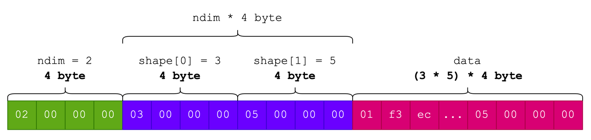
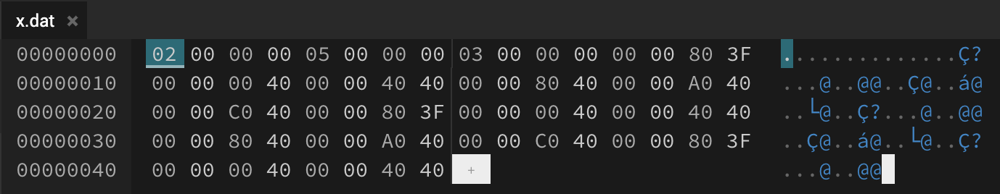

# Neural network runtime dengan C

Dunia ideal saya soal *machine learning deployment* adalah distribusi seminimal mungkin.
Minimal dua file: file executable dan file berisi parameter model yang sudah dilatih.
Cara *mainstream* adalah distribusikan proyek berikut dengan interpreter Python.


## Yang rumit adalah melatih NN, inferensi (mungkin) tidak 

Membuat pustaka NN lengkap yang mengakomodasi proses latih dan inferensi.

Untuk melatih model, pustaka modern menyediakan fitur *autograd*, yaitu pengihtungan gradien otomatis.
Ini berguna untuk memperbarui paramter model selama proses belajar.
Selain itu, proses komputasi juga harus cepat. Ini membutuhkan optimasi di sana-sini, yang membutuhkan upaya yang sangat... monumental.

Objektif proyek:

> Ekspor parameter model NN (baik *pretrained* maupun hasil latih sendiri), muat dalam program C, gunakan untuk inferensi.

## Saya menggunakan C

Pertanyaan yang pasti muncul:

> Mengapa C? Bukankah Julia bisa? Bukanlah Rust juga bisa?

- Karena C minimalis, tidak butuh toolchain yang terlalu besar. Toolchain yang minimalis buat saya *sparks joy*✨. Jika mau, kita bisa pakai salah satu compiler C terkecil, [tcc]().
- Karena C adalah *lingua franca*: fungsi yang ditulis di C dapat dipanggil di bahasa lain, dan yang terpenting, saya bisa menyasar microcontroller (yang juga merupakan salah satu target saya nanti).
- Saya <s>masokis</s> merasa tertantang.
- For fun.

## NN hanyalah soal operasi tensor, dan pada praktiknya, tensor hanyalah *byte array*


Model NN, sekecil atau sebesar apapun itu, hanyalah seonggok angka-angka yang hanya berguna dengan operasi aritmatika.
Suatu model NN dengan satu *hidden layer* $relu(\mathbf{x}\mathbf{w}_1+\mathbf{b}_1)\mathbf{w}_2+\mathbf{b}_2$

```python
from torch.nn import Sequential, Linear, ReLU

model = Sequential(
    Linear(3, 5),
    ReLU(),
    Linear(5, 2),
)

print(model)


""" Output:

Sequential(
  (0): Linear(in_features=3, out_features=5, bias=True)
  (1): ReLU()
  (2): Linear(in_features=5, out_features=2, bias=True)
)

"""
```

```python
print(model[0].weight.detach().numpy(), "\n")
print(model[0].bias.detach().numpy(), "\n")
print(model[2].weight.detach().numpy(), "\n")
print(model[2].bias.detach().numpy(), "\n")


""" Output:

[[-0.05593944  0.45469582  0.28000206]
 [ 0.3861447  -0.25333872 -0.46768567]
 [-0.25107583 -0.17574829 -0.46110478]
 [ 0.3162706   0.3284096  -0.5111614 ]
 [ 0.36777872  0.38549262  0.45413244]] 

[ 0.4335612   0.53432095 -0.5666646   0.50835824  0.46640122] 

[[ 0.2071963   0.18049729  0.44086027  0.39566457 -0.22345108]
 [ 0.22607613  0.33495134  0.27171385 -0.00866625 -0.2844745 ]] 

[0.3454901 0.0193561] 

"""
```

## Strategi mengekspor tensor

Seluruh informasi tensor yang dibutuhkan akan disimpan sebagai byte array.
Sebagai ilustrasi, kita memiliki tensor (`np.ndarray`) berdimensi 2 (atau `x.ndim == 2`) dan ukuran $3 \times 5$ (atau `x.shape == (3, 5)`).

Penataan data tensor tersebut dalam format byte array adalah sebagai berikut:

- Bagian pertama adalah informasi jumlah dimensi tensor (`ndim`) yang direpresentasikan dengan integer (4 byte). Maka, 4 byte pertama pada byte array digunakan untuk menyimpan `ndim` bernilai 2.
- Empat byte setelahnya menampung angka 3 (ukuran dimensi pertama), kemudian empat byte setelahnya lagi menampung angka 5 (ukuran dimensi kedua).
- Setelahnya, barulah kita meletakkan seluruh data tensor itu sendiri sebagai array yang diratakan (*flatten*, sebagai array 1 dimensi).

Berikut ini ilustrasinya:



<p class="caption">Penataan metadata dan data tensor</p>

Kita bisa dengan mudah melakukan hal ini dengan NumPy seperti berikut ini.

```python
import numpy as np
from io import BufferedWriter


def dump_ndarray(x: np.ndarray, f: BufferedWriter):
    x = np.ascontiguousarray(x, dtype=np.float32)
    # Secara berurutan, tuliskan  ndim, shape, data tensor
    np.array(x.ndim, dtype=np.int32).tofile(f)
    np.array(x.shape, dtype=np.int32).tofile(f)
    f.write(x.tobytes())

x = np.array(
    [[1, 2, 3], 
     [4, 5, 6],
     [1, 2, 3],
     [4, 5, 6],
     [1, 2, 3]]
)

with open("x.dat", "wb") as f:
    dump_ndarray(x, f)
```

Tipe data `np.int32` (setara dengan `int` pada C) dan `np.float32` (setara dengan `float` pada C) sama-sama berukuran 4 byte. Secara default numpy menggunakan *big [endian](https://en.wikipedia.org/wiki/Endianness)* untuk urutan byte.
Jika `x.dat` dibuka dengan *hex editor*, maka kontennya kurang lebih akan seperti ini:




### Representasi tensor pada C

Saya pikir, pustaka tensor seperti PyTorch dan NumPy memiliki tiga komponen utama: data, bentuk, dan jumlah dimesi.
Operasi-operasi seperti parkalian matriks dan konvolusi dapat dilakukan cukup dengan mengetahui ketiganya.
Berikut ini cara saya merepresentasikan struktur data tensor pada C:

```C
#define NNRT_FLOAT float

typedef struct {
    NNRT_FLOAT *data;
    int *shape;
    int ndim;
} nnrt_Tensor;
```

```C
nnrt_Tensor *nnrt_tensor_fread(FILE *fp) {
    nnrt_Tensor *tensor = (nnrt_Tensor *)malloc(sizeof(nnrt_Tensor));

    fread(&tensor->ndim, sizeof(int), 1, fp);

    tensor->shape = (int *)malloc(tensor->ndim * sizeof(int));
    fread(tensor->shape, sizeof(int), tensor->ndim, fp);

    size_t sz = nnrt_tensor_size(tensor);

    tensor->data = (NNRT_FLOAT *)malloc(sz * sizeof(NNRT_FLOAT));
    fread(tensor->data, sizeof(NNRT_FLOAT), sz, fp);

    return tensor;
}
```

## *Multi-layer perceptron*

Setelah mekanisme memuat tensor di C sudah dibuat, yang tersisa (banyak) selanjutnya adalah membuat fungsi-fungsi untuk kebutuhan inferensi.
Sebelumnya, saya akan membuat *classifier* sederhana menggunakan `MLPClassifier` dari pustaka `scikit-learn`.
`MLPClassifier` adalah kelas untuk membuat *fully-connected NN* dengan mudah.

```python
from sklearn.datasets import load_iris
from sklearn.neural_network import MLPClassifier
from sklearn.preprocessing import MinMaxScaler

from dump import dump_ndarray_list


def dump_ndarray_list(ndarray_list: List[np.ndarray], filename: str) -> None:
    with open(filename, "wb") as f:
        for x in ndarray_list:
            dump_ndarray(x, f)


x, y = load_iris(return_X_y=True)
y = y.ravel()
x = MinMaxScaler().fit_transform(x)

# MLP dengan 2 hidden layer
clf = MLPClassifier(hidden_layer_sizes=(100, 20), max_iter=1000).fit(x, y)

# clf.coefs_ adalah list yang berisi 3 ndarray, 2 untuk parameter hidden layer
# dan 1 untuk parameter output layer.
# clf.intercepts_ juga list berisi 3 ndarray untuk bias.
all_params = clf.coefs_ + [i.reshape(1, -1) for i in clf.intercepts_]

# Kita ekspor semua tensor secara sekuensial, semua data tensor
# saling bersebelahan
dump_ndarray_list(all_params, "mlp.dat")
```

Parameter yang sudah dilatih disimpan pada atribut `coefs_` (bobot $\mathbf{w}$) dan `intercept_` (bias $\mathbf{b}$).
Semuanya bertipe `np.ndarray`.
Keuntungan fungsi `dump_ndarray()` dia atas adalah, selama tensor (dari pustaka apapun) berupa `np.ndarray` atau setidaknya bisa dikonversi menjadi `np.ndarray`, kita bisa mengekspornya.

Ini termasuk model MLPClassifier


<div class="toggle">

```C
#include <stdio.h>
#include <stdlib.h>
#include <string.h>

#include "../nnrt.h"

int main(void) {
    // Sample of min-max scaled of iris dataset
    float x_data[] = {
        0.22222222, 0.62500000, 0.06779661, 0.04166667,  // -> 0
        0.16666667, 0.41666667, 0.06779661, 0.04166667,  // -> 0
        0.61111111, 0.41666667, 0.71186441, 0.79166667,  // -> 2
        0.52777778, 0.58333333, 0.74576271, 0.91666667   // -> 2
    };
    nnrt_Tensor *x = nnrt_tensor_alloc(2, (int[]){4, 4});
    memcpy(x->data, x_data, 16 * sizeof(float));

    // Load trained parameters
    char *filename = "mlp.dat";
    FILE *fp = fopen(filename, "rb");
    if (!fp) {
        printf("Cannot load weight\n");
        exit(1);
    }
    nnrt_Tensor *w1 = nnrt_tensor_fread(fp);
    nnrt_Tensor *w2 = nnrt_tensor_fread(fp);
    nnrt_Tensor *w3 = nnrt_tensor_fread(fp);
    nnrt_Tensor *b1 = nnrt_tensor_fread(fp);
    nnrt_Tensor *b2 = nnrt_tensor_fread(fp);
    nnrt_Tensor *b3 = nnrt_tensor_fread(fp);
    fclose(fp);

    // Hidden layer 1
    nnrt_Tensor *h1 = nnrt_tensor_alloc(2, (int[]){4, 100});
    nnrt_affine(x, w1, b1, h1);
    nnrt_relu(h1, h1);

    // Hidden layer 2
    nnrt_Tensor *h2 = nnrt_tensor_alloc(2, (int[]){4, 20});
    nnrt_affine(h1, w2, b2, h2);
    nnrt_relu(h2, h2);

    // Output layer
    nnrt_Tensor *out = nnrt_tensor_alloc(2, (int[]){4, 3});
    nnrt_affine(h2, w3, b3, out);
    nnrt_relu(out, out);

    //// optionally, calculate softmax
    // nnrt_softmax(out, 1, out);

    // Get labels
    nnrt_Tensor *lbl = nnrt_tensor_alloc(2, (int[]){4, 1});
    nnrt_argmax(out, 1, lbl);

    printf("Labels:\n");
    for (size_t i = 0; i < 4; i++)
        printf("%f\n", lbl->data[i]);

    // Free params 
    nnrt_tensor_free(x);
    nnrt_tensor_free(w1);
    nnrt_tensor_free(w2);
    nnrt_tensor_free(w3);
    nnrt_tensor_free(b1);
    nnrt_tensor_free(b2);
    nnrt_tensor_free(b3);

    // Free intermediary variables
    nnrt_tensor_free(h1);
    nnrt_tensor_free(h2);
    nnrt_tensor_free(out);
    nnrt_tensor_free(lbl);

    return 0;
}

```

</div>
