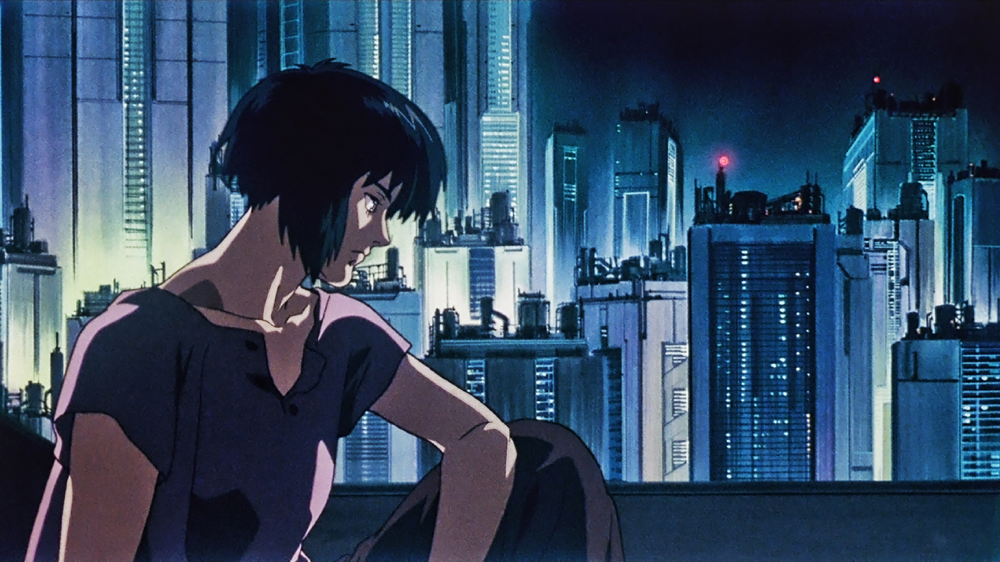
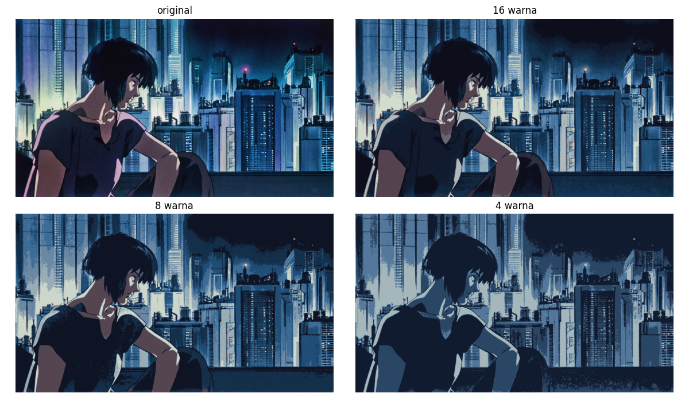
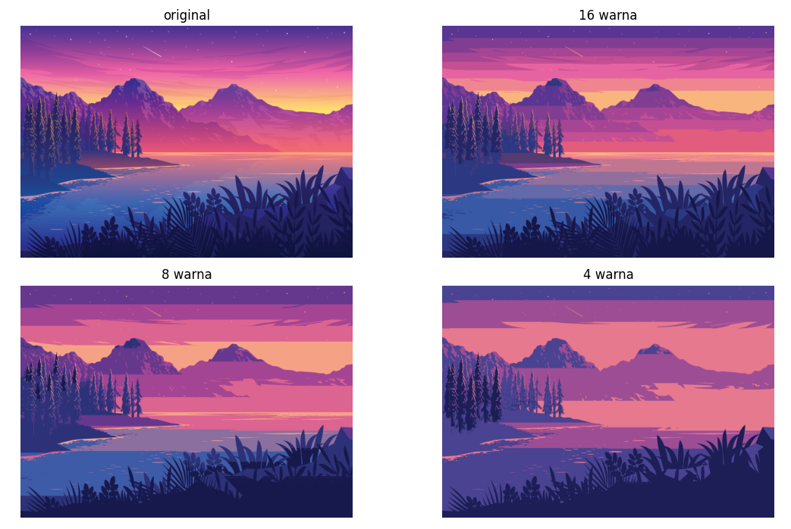

# K-Means untuk ekstraksi palet warna otomatis

Di dunia _unsupervised learning_, K-Means cukup populer untuk mengelompokkan data dengan kemiripan.
Data-data yang mirip akan memiliki label cluster yang sama.
Pada K-Means, label cluster mewakili centroid, yaitu nilai yang berada di tengah-tengah data yang mirip (atau saling berdekatan berdasarkan _feature-feature_-nya).

Anggap satu gambar adalah dataset itu sendiri, yang terdiri dari banyak _data points_ berupa pixel-pixel.
Masing-masing pixel mewakili satu sampel dengan 3 _feature_: komponen warna merah (R), hijau (G), dan biru (B).
Maka, setelah kita menjalankan K-Means pada gambar tersebut, nilai-nilai _centroid_ akan menjadi warna-warna yang dominan. 
Dengan kata lain, palet warna adalah warna-warna dominan pada suatu gambar, yang dalam hal ini direpresentasikan oleh nilai-nilai _centroid_.


<p class="caption">Gambar rujukan (<a href="https://assets.mubicdn.net/images/artworks/235968/images-original.png?1621568236">sumber</a>) </p>


<p class="caption">Palet warna terekstraksi</p>

## Ekstraksi palet warna

Pertama, kita siapkan fungsi untuk memuat gambar.

```python
from io import BytesIO
from typing import Tuple

import matplotlib.pyplot as plt
import numpy as np
import requests
from PIL import Image
from sklearn.cluster import KMeans


def load_image(path: str) -> np.ndarray:
    if path.startswith(("http://", "https://")):
        response = requests.get(path)
        img = Image.open(BytesIO(response.content))
    else:
        img = Image.open(path)
    return img
```

Sebagai bonus, fungsi ini dapat memuat gambar baik dari _path_ lokal maupun URL web.
Jika _path_ berupa URL, fungsi akan mengunduh gambar menggunakan pustaka `requests` dan membukanya dengan PIL.
Jika _path_ merujuk pada berkas lokal, ia akan langsung membuka file menggunakan PIL. 

Setelah gambar dimuat, kita bisa menganalisisnya untuk mengekstrak palet warna.

```python
def get_palette(
    img: Image,
    n_colors: int,
    resize_shape: Tuple[int, int] = (100, 100)
) -> Tuple[np.ndarray, KMeans]:
    img = np.asarray(img.resize(resize_shape)) / 255.0
    h, w, c = img.shape
    img_arr = img.reshape(h * w, c)

    kmeans = KMeans(n_clusters=n_colors, n_init="auto").fit(img_arr)
    palette = (kmeans.cluster_centers_ * 255).astype(int)

    return palette, kmeans
```

Fungsi ini menerima objek gambar PIL, jumlah warna yang diinginkan dalam palet, dan ukuran gambar yang diubah (opsional).
Jika gambar berukuran terlalu besar, waktu yang dibutuhkan untuk menjalankan K-Means akan lama.
Oleh karena itu, pengubahan ukuran gambar dapat mempercepat proses tanpa mengurangi kualitas palet secara signifikan.

Atribut `cluster_centers_` menyimpan pusat dari setiap kluster, yang pada konteks ini mewakili warna dominan dalam gambar.
Warna-warna dominan inilah yang dimaksud dengan palet warna.
Karena gambar diolah dalam skala 0 hingga 1, kita mengembalikannya ke range 0 hingga 255, yaitu range yang umum dalam representasi warna RGB dengan tipe integer.

## Kuantifikasi warna gambar

Hal lain yang bisa kita lakukan jika sudah memiliki palet warna adalah melakukan **kuantifikasi warna** pada gambar.
Kuantisasi warna adalah proses pemetaan ruang warna asli ke set warna terbatas (warna unik yang lebih sedikit).
Ini berguna untuk mengurangi memori yang diperlukan untuk menyimpan gambar tanpa kehilangan karakteristik utamanya.

```python
def quantize_image(image: Image, kmeans: KMeans) -> np.ndarray:
    image_np = np.asarray(image) / 255.0
    h, w, c = image_np.shape

    # Petakan masing-masing pixel ke index cluster terdekat
    flatten = image_np.reshape(h * w, c)
    pixel_rgb_clusters = kmeans.predict(flatten)

    # Kemudian kita bisa memetakan balik dari index cluster ke nilai RGB dari centroid
    image_quantized = kmeans.cluster_centers_[pixel_rgb_clusters]

    return image_quantized.reshape(h, w, c)
```

Proses kuantisasi menggantikan setiap pixel dalam gambar dengan warna yang paling mendekati dari palet yang telah diekstraksi. Dalam konteks ini, palet diwakili oleh _centroid_ dari model K-Means.
Hasil dari kuantisasi ini adalah gambar yang warnanya telah direduksi ke jumlah warna yang sudah ditentukan oleh palet.
Ini menjaga karakteristik visual utama gambar sembari mengurangi kompleksitas warna. 


<p class="caption">Hasil kuantifikasi warna dengan 16, 8, dan 4 warna palet</p>

Berikut ini hasilnya jika digunakan pada [gambar lain](https://static.vecteezy.com/system/resources/previews/003/623/626/original/sunset-lake-landscape-illustration-free-vector.jpg).


<p class="caption">Hasil dengan gambar berbeda</p>


<p class="caption">Palet warna terekstraksi dengan 8 warna</p>

---

## Kode selengkapnya

<details>
  <summary>Show/hide code</summary>

```python
from io import BytesIO
from typing import Tuple

import matplotlib.pyplot as plt
import numpy as np
import requests
from PIL import Image
from sklearn.cluster import KMeans


def load_image(path: str) -> np.ndarray:
    if path.startswith(("http://", "https://")):
        response = requests.get(path)
        img = Image.open(BytesIO(response.content))
    else:
        img = Image.open(path)
    return img


def get_palette(
    img: Image, n_colors: int, resize_shape: Tuple[int, int] = (100, 100)
) -> Tuple[np.ndarray, KMeans]:
    img = np.asarray(img.resize(resize_shape)) / 255.0
    h, w, c = img.shape
    img_arr = img.reshape(h * w, c)

    kmeans = KMeans(n_clusters=n_colors, n_init="auto").fit(img_arr)
    palette = (kmeans.cluster_centers_ * 255).astype(int)

    return palette, kmeans


def quantize_image(image: Image, kmeans: KMeans) -> np.ndarray:
    image_np = np.asarray(image) / 255.0
    h, w, c = image_np.shape

    # Petakan masing-masing pixel ke index cluster terdekat
    flatten = image_np.reshape(h * w, c)
    pixel_rgb_clusters = kmeans.predict(flatten)

    # Kemudian kita bisa memetakan balik dari index cluster ke nilai RGB dari centroid
    image_quantized = kmeans.cluster_centers_[pixel_rgb_clusters]

    return image_quantized.reshape(h, w, c)


if __name__ == "__main__":
    url = "https://assets.mubicdn.net/images/artworks/235968/images-original.png?1621568236"
    image = load_image(url)

    num_colors = 8
    color_palette, kmeans = get_palette(image, num_colors)

    print(color_palette)
    print(color_palette.shape)

    """
    Tampilkan palet warna
    """
    # Urutkan warna palet dari yang paling "terang" (yaitu warna dengan nilai grayscale tertinggi)
    color_palette_sorted = np.array(sorted(color_palette, key=lambda x: x.mean())[::-1])

    plt.imshow(color_palette_sorted[np.newaxis, :, :])
    plt.axis("off")
    plt.show()

    """
    Tampilkan hasil kuantifikasi warna pada gambar
    """

    image_labels = "bcd"
    num_colors = [16, 8, 4]

    layout = """
    ab
    cd
    """

    fig, ax = plt.subplot_mosaic(layout, figsize=(12, 7), sharey=True)
    ax["a"].imshow(image)
    ax["a"].set_title("original")
    ax["a"].axis("off")

    for label, num_color in zip(image_labels, num_colors):
        color_palette, kmeans = get_palette(image, num_color)
        image_quantized = quantize_image(image, kmeans)

        ax[label].imshow(image_quantized)
        ax[label].set_title(f"{num_color} warna")
        ax[label].axis("off")

    plt.tight_layout()
    plt.show()
```

</details>

## Ide-ide lanjutan

- **Style generator:** Membuat _generator_ tema teks editor atau desktop/window manager berdasarkan palet warna gambar
- **Implementasi algoritma kompresi gambar sederhana berbasis kuantifikasi warna:** Bagaimana menyimpan dan memuat gambar hasil kuantifikasi warna menjadi file yang ringkas?
- **Analisis sentimen warna:** Menggunakan palet warna dari gambar untuk menganalisis dan menafsirkan emosi atau sentimen yang mungkin terkandung dalam gambar, seperti keceriaan, kegelapan, atau kesedihan
- **Algoritma _dithering_:** Menggabungkan kuantisasi warna dengan teknik dithering untuk menciptakan efek visual yang lebih halus, terutama saat jumlah warna dalam palet sangat terbatas
- **Kustomisasi UI otomatis:** Menggunakan palet warna dari gambar profil pengguna untuk mengkustomisasi tampilan antarmuka aplikasi, menciptakan pengalaman yang lebih personal
- **Rekomendasi produk berdasarkan warna:** Membuat sistem rekomendasi yang mengusulkan produk dengan warna serupa, seperti pakaian atau dekorasi interior, berdasarkan palet warna yang diekstrak dari gambar favorit pengguna.