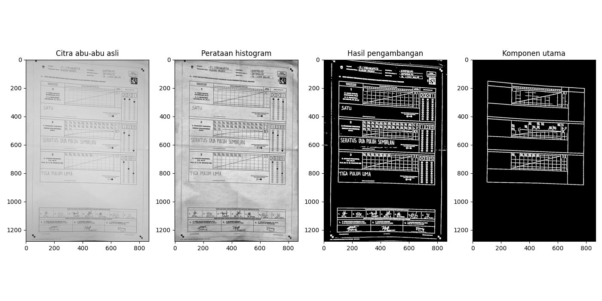

# Optical character recognition (OCR) form

- Not cold-start: sudah ada data.
    - Membutuhkan sedikit data latih.
    - Butuh penyesuaian: simulasi, kumpulkan sampel digit tertulis data dari pemilu sebelumnya
    - Transfer learning, combine sedikit MNIST & sebagian sampel baru (not tested)

- Batasan masalah
    - C1 plano
    - OCR, bukan arsiran
    - Prototype, python. Untuk level production, ada banyak pustaka sepadan dengan fungsi yang serupa (tidak selalu betul-betul sama berdasarkan *signature*-nya, namun tujuannya sama).

- General flow
    - Preprocessing -> RoI extraction -> Digit slicing -> classification

## Preprocessing

### Grayscale, histogram equalization

- Global vs adaptive (CLAHE)
    - Example 1.jpeg

### Binary image

- Thresholding -> easier to find important parts
-

## Main component extraction

