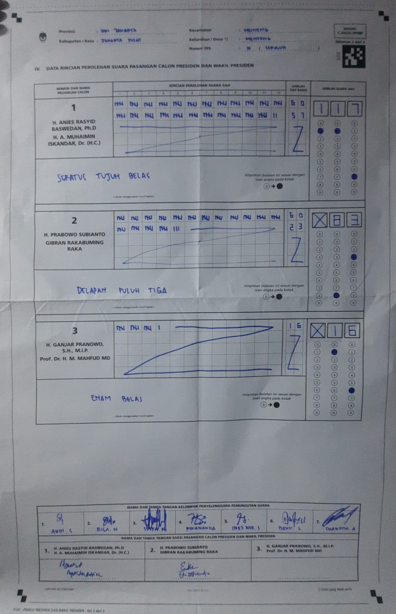
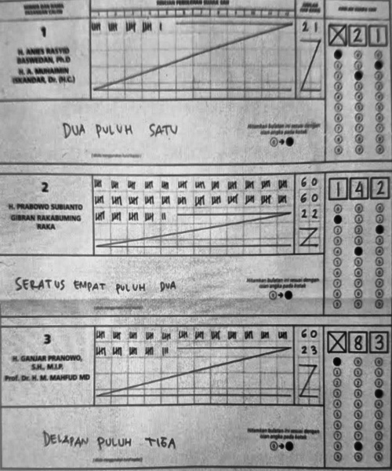
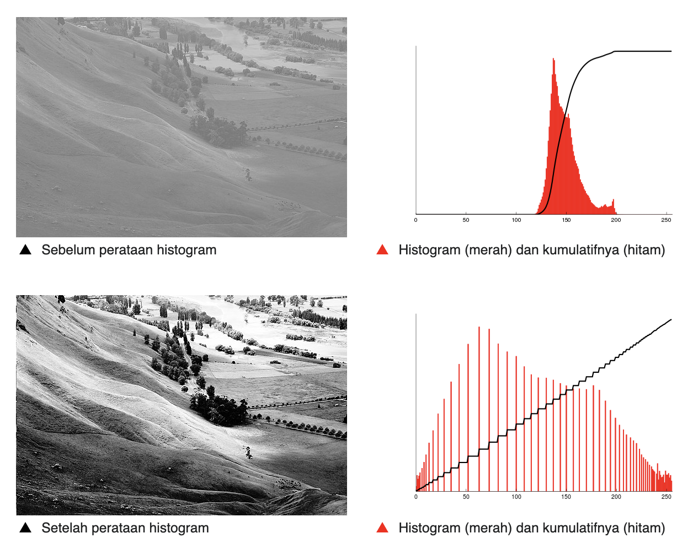
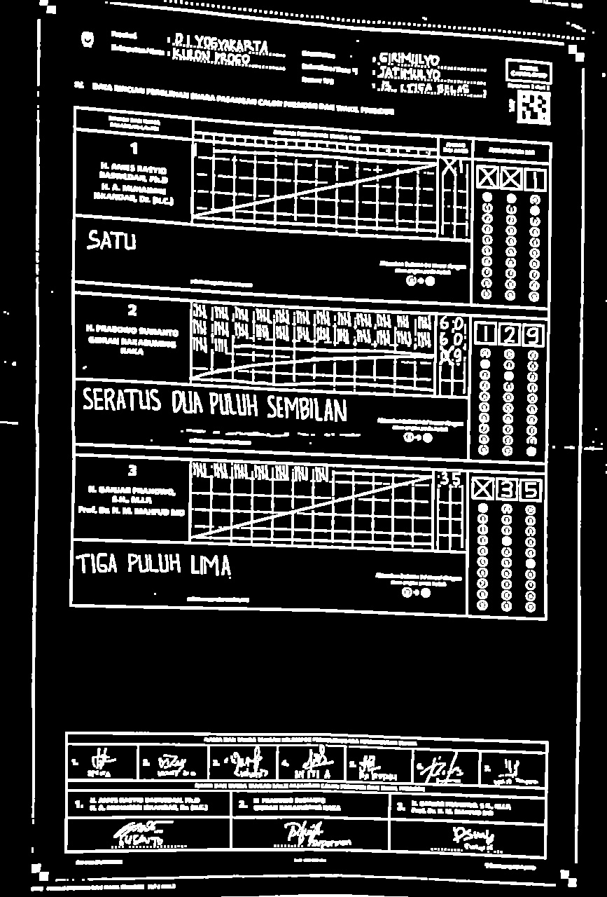
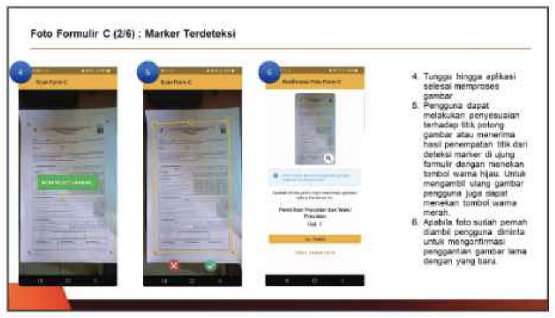
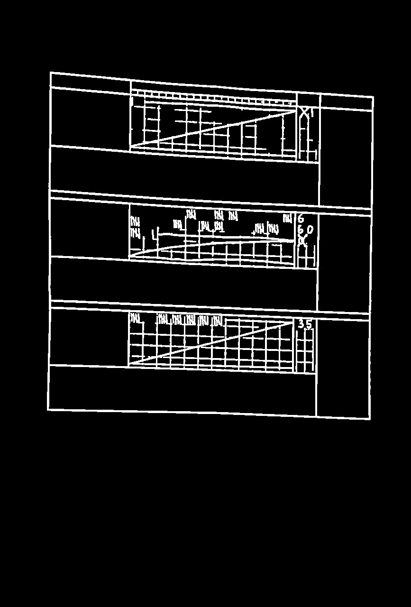
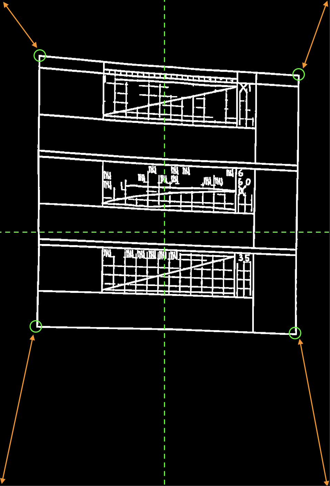
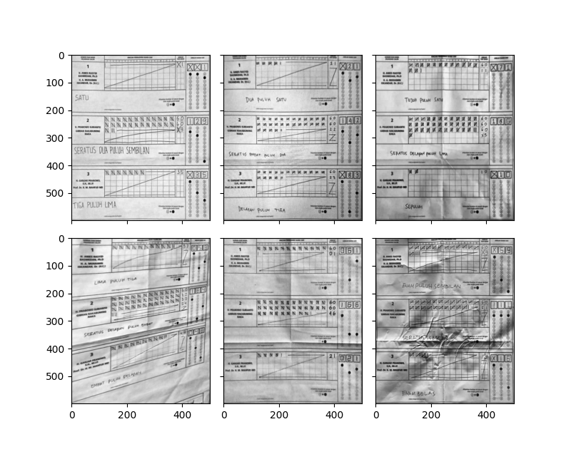

# Pengenalan digit tertulis pada formulir C1-Plano Pemilu (bagian 1: pra-pemrosesan citra)

Pemilihan umum (pemilu) Indonesia 2024 melibatkan sistem rekapitulasi berbasis mobile yang secara otomatis melakukan pengenalan karakter (digit) tertulis atau _optical character recognition_ (OCR) untuk mempercepat diseminasi hasil hitung.
Di tulisan ini saya akan memaparkan implementasi OCR berdasarkan interpretasi sendiri.

Tulisan ini bersifat pedagogis dengan menunjukkan teknik sederhana dan alat umum (Python dengan beberapa pustakanya) yang dapat digunakan untuk permasalahan pengenalan digit.
Walau hasil akhirnya akan berkualitas purwarupa (_prototype_), dengan cukup kreativitas pembaca dapat mengembangkannya sendiri.
Misalnya, dengan mengulangi langkah-langkahnya untuk pengembangan di _platform_ mobile.

## _Layout_ formulir C1-Plano dan permasalahan pengambilan citra

Gambar di bawah ini adalah contoh formulir C1-Plano untuk Pemilu 2024.
Formulir ini menyediakan ruang khusus untuk mencatat perhitungan suara melalui turus dan hasil rekapitulasi.
Selain mencantumkan angka hasil hitungan, formulir ini juga memiliki area arsiran yang disesuaikan dengan angka hasil perhitungan.



<p class="caption">Contoh formulir C1-Plano (<a href="https://pemilu2024.kpu.go.id/pilpres/hitung-suara/31/3171/317106/3171061001/3171061001010">sumber</a>) </p>

> Sebagai bahan praktik, pembaca dipersilakan untuk mengunduh sendiri contoh formulir C1-Plano di [situs KPU](https://pemilu2024.kpu.go.id/) atau [KawalPemilu](https://kawalpemilu.org).
> Data citra formulir di KawalPemilu salah satunya bersumber dari relawan dan lebih merefleksikan keadaan di lapangan, sehingga lebih "menantang".
> Citra formulir di situs KPU cenderung lebih rapi karena panitia telah mendapatkan pengarahan sebelumnya perihal teknis pengambilan gambar.

Untuk proses OCR, sebetulnya kita hanya perlu area penting saja (_region of interest_ atau RoI), yaitu bagian angka hasil hitung masing-masing paslon sisi pinggir kanan, kolom "jumlah suara sah".
Idealnya, kita cukup memotong area angka pada foto formulir tersebut, ambil digit-digitnya sesuai dengan koordinat tertentu, dan lakukan klasifikasi dengan suatu model _machine learning_.
Namun, sepertinya tidak akan semudah itu.
Ada beberapa masalah yang akan ditemui di hasil foto C1-Plano, setidaknya, antara lain:

1. Perbedaan sudut pandang/perspektif pengambilan gambar, sehingga hasil nampak miring
2. Pencahayaan yang tidak konsisten karena tidak ada standarisasi teknis alat pengambilan gambar
3. Perbedaan kualitas gambar, karena beda tempat pemungutan suara (TPS) kemungkinan beda pula kamera yang digunakan panitia
4. _Occlusion_, yaitu adanya bagian pada gambar yang terhalangi objek lain, misalnya gambar terhalangi tangan orang lain saat pengambilan gambar
5. Inkonsistensi penulisan digit tiap orang

Permasalahan 1 - 4 akan diselesaikan pada tahap pra-pemrosesan dengan menggunakan beberapa teknik pengolahan citra digital.
Untuk permasalahan 5, saya akan mengandalkan teknik _machine learning_ dengan model _neural network_.
Solusi permasalahan 5 akan dipaparkan pada tulisan bagian kedua.

## Pra-pemrosesan citra (_image preprocessing_)

Tahap pertama adalah pra-pemrosesan.
Kita akan bekerja dengan citra dalam skala abu-abu (_grayscale image_) dan biner karena informasi warna tidak terlalu penting.
Oleh karenanya, perlu dilakukan konversi citra berwarna ke _grayscale_ jika dibutuhkan.
Hasil akhir yang diharapkan di tahap ini adalah RoI dengan distribusi keabuan dan kontras citra yang sudah ditingkatkan, dan perspektif yang diperbaiki, seperti berikut ini.



<p class="caption">Hasil pra-pemrosesan</p>

### Perbaikan kontras dengan teknik perataan histogram (_histogram equalization_)

Citra formulir bisa dipastikan tidak selalu ideal.
Salah satu masalah utama yang ditemukan adalah buruknya kontras yang berakibat sulitnya pendeteksian garis dan komponen citra lainnya.
Untuk permasalahan ini, kita dapat menggunakan teknik perataan histogram[^1].
Sederhananya, teknik ini akan menyebarkan intensitas keabuan secara merata sehingga bagian dengan kontras rendah bisa menjadi lebih tinggi.
Efek dari perataan histogram dicontohkan oleh gambar di bawah ini.



<p class="caption">Citra sebelum dan sesudah perataan histogram (<a href="https://id.wikipedia.org/wiki/Perataan_histogram">sumber</a>)</p>

Perlu dicatat bahwa teknik perataan yang akan digunakan bukanlah perataan yang biasa, namun perataan histogram **adaptif**.
Tepatnya, saya akan menggunakan perataan histogram adaptif dengan pembatasan kontras, atau _contrast-limited adaptive histogram equalization_ (CLAHE)[^2].
Mengapa adaptif? Karena, dalam beberapa kasus, perataan histogram biasa bekerja pada seluruh citra sebagai satu unit.
Ini berarti bahwa perubahan yang dibuat pada histogram diterapkan secara seragam ke seluruh citra.
Di sisi lain, metode adaptif memungkinkan kita untuk melakukan perataan histogram berdasarkan bagian-bagian lebih kecil dari citra, sehingga dapat menangkap konteks area yang lebih lokal.

Bagian pertama pra-pemrosesan ini dapat dibuat dengan mudah sebagai berikut:

```python
from typing import Tuple
import numpy as np
import cv2


def preprocess(gray_image: np.ndarray) -> Tuple[np.ndarray, np.ndarray]:
    gray_image = cv2.GaussianBlur(gray_image, (3, 3), 0)
    clahe = cv2.createCLAHE(clipLimit=3.0, tileGridSize=(11,11))
    equalized = clahe.apply(gray_image)

    ...
```

### Pengambangan citra (_image thresholding_)

Pengambangan citra digunakan untuk memisahkan objek dari latar belakangnya[^3].
Teknik ini melibatkan konversi citra abu-abu menjadi citra biner, di mana piksel citra dikategorikan menjadi dua nilai intensitas (misalnya, hitam/putih) berdasarkan nilai ambang batas (threshold) tertentu.

Seperti perataan histogram, pengambangan citra juga bisa bekerja dalam model global dan adaptif.
Dalam pengambangan citra biasa, nilai ambang batas yang sama diterapkan secara seragam ke seluruh piksel citra.
Nilai ambang batas ini biasanya adalah nilai konstan yang dipilih berdasarkan analisis histogram citra atau kriteria tertentu.
Semua piksel dengan intensitas di atas ambang batas diatur ke nilai maksimal (misalnya, putih pada citra biner), dan piksel dengan intensitas di bawah ambang batas diatur ke nilai minimal (misalnya, hitam).
Pengambangan citra adaptif, seperti namanya, melibatkan pemilihan nilai ambang batas yang berbeda-beda untuk setiap wilayah atau piksel citra, berdasarkan karakteristik lokal citra tersebut.


<p class="caption">Pengambangan lokal vs adaptif (<a href="https://en.wikipedia.org/wiki/Thresholding_%28image_processing%29">sumber</a>)</p>


Metode adaptif lebih fleksibel dibandingkan dengan pengambangan citra biasa karena dapat menyesuaikan ambang batas secara lokal, memungkinkan untuk mengatasi variasi pencahayaan atau kontras yang ada di dalam citra.
Ini berguna terutama pada citra dengan pencahayaan yang tidak merata, di mana pengambangan global mungkin tidak efektif dalam memisahkan objek dari latar belakang di seluruh citra.
Oleh karena itu, saya akan menggunakan metode adaptif.
Kode fungsi `preprocess` dapat dilengkapi sebagai berikut.

```python
def preprocess(gray_image: np.ndarray) -> Tuple[np.ndarray, np.ndarray]:
    gray_image = cv2.GaussianBlur(gray_image, (3, 3), 0)
    clahe = cv2.createCLAHE(clipLimit=5.0, tileGridSize=(11,11))
    equalized = clahe.apply(gray_image)

    thresholded = cv2.adaptiveThreshold(
        equalized,
        255,
        cv2.ADAPTIVE_THRESH_MEAN_C,
        cv2.THRESH_BINARY_INV,
        15,
        15,
    )

    thresholded = cv2.erode(thresholded, np.ones((2, 2)), iterations=1)
    thresholded = cv2.dilate(thresholded, np.ones((2, 2)), iterations=2)

    return thresholded, equalized

```

Pengambagan adaptif yang saya gunakan berbasis _mean_ (dengan argumen `cv2.ADAPTIVE_THRESH_MEAN_C`), yang berarti bahwa kita menggunakan nilai rerata dari piksel bertetanggaan sebagai nilai ambang batas.
Argumen `cv2.THRESH_BINARY_INV` berarti bahwa kita nilai piksel yang lebih besar daripada nilai ambang akan dianggap 0 (hitam), dan jika tidak, akan dianggap 255 (putih).
Ini bertujuan untuk menjadikan garis berwarna putih sebagai objek _foreground_, sekaligus mengikuti konvensi OpenCV yang menganggap putih sebagai _foreground_.

Saya akan menggunakan [contoh citra formulir di tautan ini](img/ref.jpeg) sebagai contoh yang relatif mudah, tapi agak kurang ideal (sudut pandang agak miring).
Fungsi di atas jika diterapkan pada citra abu-abu formulir C1-Plano, akan menghasilkan citra terambangkan seperti berikut ini.



<p class="caption">Hasil pengambangan </p>

Tugas selanjutnya adalah mengambil satu persegi besar di tengah (piksel putih terhubung yang membentuk _quadrilateral_) yang berisi hasil penghitungan, dan membuang bagian putih selainnya.


### Ekstraksi RoI dan digit

> Berdasarkan [petunjuk teknis](https://mmc.tirto.id/documents/2024/02/12/1839-buku-panduan-kpps-pemilu-2024-v3-11zon-1.pdf?x=2927), aplikasi sirekap Komisi Pemilihan Umum (KPU) mengandalkan deteksi _marker_, yaitu kotak-kotak hitam di sudut kertas formulir.
> 
> Saya menduga ini cara mereka untuk melakukan ekstraksi RoI.
> Ini mungkin akan bekerja dengan baik jika teknis pengambilan citra terstandarisasi, seperti yang banyak ditemui di situs resmi KPU.
> Namun, kekurangan dari pendekatan ini adalah, terkadang, keempat _marker_ tidak terfoto dengan sempurna, khususnya citra dari relawan yang cenderung fokus pada hasil hitung.
> Oleh karena itu, saya memilih pendekatan lain: langsung saja kita deteksi _quadrilateral_ yang berisi hasil penghitungan suara.

Pertama, lakukan analisis komponen terhubung.
Sebuah komponen terhubung dalam citra adalah kumpulan piksel yang terhubung satu sama lain melalui tetangganya dan memiliki properti serupa (misalnya, intensitas yang sama dalam citra biner).
Misalnya, suatu garis terbentuk dari beberapa piksel yang terhubung.
Dua piksel dianggap "terhubung" jika mereka berdekatan dan memenuhi kriteria tertentu (biasanya berdasarkan nilai piksel).

Ketika sebuah komponen terhubung ditemukan, semua piksel dalam komponen tersebut diberi label yang sama.
Ini dapat dilakukan menggunakan algoritma seperti _flood-fill_ atau algoritma _two-pass_.
Setelah semua komponen terhubung dilabeli, atribut seperti ukuran, bentuk, atau posisi dapat diekstraksi untuk setiap komponen.

Komponen yang kita butuhkan (selanjutnya akan saya sebut sebagai **komponen utama**) diasumsikan memiliki tinggi yang lebih tinggi daripada $\frac 2 5$ kali tinggi citra, dan memiliki lebar lebih dari setengah lebar citra.
Tidak ada cara yang lebih baik daripada bereksperimen dengan mengganti nilai-nilai tersebut.

```python
def get_main_component(binary_img: np.ndarray) -> Tuple[np.ndarray, np.ndarray]:
    labeled_image, n_labels = label(binary_img, connectivity=2, return_num=True)  # type: ignore

    valid = []
    height, width = binary_img.shape[:2]
    for i in range(1, n_labels + 1):
        _, _, h, w = component_rect(labeled_image, i)
        if h > int(float(height) * (2.0 / 5.0)) and w > width // 2:
            valid.append(i)
            break

    img = np.zeros((height, width))
    img[labeled_image == valid[0]] = 255  # Take only the valid component

    return img, labeled_image
```

Fungsi di atas digunakan pada citra yang sudah melalui proses pengambangan (luaran dari fungsi `preprocess`).
Jika berhasil menemukan komponen utama, hasilnya kurang lebih akan seperti berikut ini.



<p class="caption">Komponen utama yang terekstraksi</p>

_"Kenapa tulisan-tulisan dan angka-angkanya hilang?"_

Tidak masalah. Nanti kita bisa kembalikan dari citra aslinya.
Yang kita butuhkan sekarang adalah sudut-sudut dari komponen utama, yang berguna untuk "meluruskan" kembali perspektif citra seperti yang akan dilakukan di langkah selanjutnya.

> Catatan: algoritma ini tidak sempurna (dan tidak akan mungkin bisa sempurna), sehingga bisa saja gagal dalam menemukan komponen utama. Sisanya adalah soal bagaimana kita pandai-pandai melakukan trik olah citra.

### Mencari sudut-sudut terluar pada _quadrilateral_ komponen utama

Strategi unutk mencari sudut-sudut pada komponen utama cukup sederhana.
Misal $w$ adalah lebar citra dan $h$ adalah tinggi citra.
Dengan asumsi sumbu $Y$ positif ke arah bawah, maka:

- sudut _kiri atas_ komponen utama adalah lokasi piksel putih yang terdekat dengan koordinat $(0,0)$
- sudut _kanan atas_ komponen utama adalah lokasi piksel putih yang terdekat dengan koordinat $(0,w)$
- sudut _kiri bawah_ komponen utama adalah lokasi piksel putih yang terdekat dengan koordinat $(h,0)$
- sudut _kanan bawah_ komponen utama adalah lokasi piksel putih yang terdekat dengan koordinat $(h,w)$

Jarak sudut dengan koordinat referensi dihitung dengan _euclidean distance_:

$$
d((x_i, x_j), (x_{ref}, y_{ref})) = \sqrt{(x_i-x_{ref})^2 + (y_i-y_{ref})^2},
$$
di mana
- $(x_i, x_j) \in \mathcal{W}$, $i=1,..., h$, $j=1,...,w$
- $\mathcal{W}$ adalah himpunan koordinat piksel **berwarna putih** pada citra komponen utama.
- $(x_{ref}, y_{ref})$ adalah koordinat referensi

Maka, untuk mencari masing-masing sudut komponen utama, kita perlu menemukan solusi permasalahan minimalisasi ini:

$$
\argmin_{(x_i, x_j)} d((x_i, x_j), (x_{ref}, y_{ref}))
$$

Sebagai contoh, sudut _kiri atas_ komponen utama dicari dengan mensubstitusikan $(x_{ref}, y_{ref})$ dengan $(0, 0)$. Untuk sudut _kanan atas_, substitusikan $(x_{ref}, y_{ref})$ dengan $(0, w)$. Begitu seterusnya.

Untuk memperkecil ruang pencarian masing-masing sudut, kita dapat membagi citra komponen utama menjadi empat kuadran.
Untuk tiap kuadran, cari sudut yang diinginkan.
Gambar di bawah mengilustrasikan proses ini.



<p class="caption">Pencarian sudut-sudut <i>quadrilateral</i> komponen utama</p>

```python
def find_closest_pixel_to_point(
    pixel_coordiates: np.ndarray, reference_point: np.ndarray
) -> np.ndarray:
    min_idx = ((pixel_coordiates - reference_point) ** 2).sum(1).argmin(0)
    return pixel_coordiates[min_idx]

def get_corners(component) -> np.ndarray:
    height, width = component.shape[:2]

    # top-left
    tl_coords = np.argwhere(component[: height // 2, : width // 2] == 255)
    tl_point = find_closest_pixel_to_point(tl_coords, np.array([0, 0]))

    # top-right
    tr_coords = np.argwhere(component[: height // 2, width // 2 :] == 255)
    tr_point = find_closest_pixel_to_point(tr_coords, np.array([0, width])) + np.array(
        [0, width // 2]
    )

    # bottom-left
    bl_coords = np.argwhere(component[height // 2 :, : width // 2] == 255)
    bl_point = find_closest_pixel_to_point(bl_coords, np.array([height, 0])) + np.array(
        [height // 2, 0]
    )

    # bottom-right
    br_coords = np.argwhere(component[height // 2 :, width // 2 :] == 255)
    br_point = find_closest_pixel_to_point(
        br_coords, np.array([height, width])
    ) + np.array([height // 2, width // 2])

    corners = np.array([tl_point, bl_point, tr_point, br_point])
    return corners
```

### Koreksi perspektif (_deskewing_)

Setelah menemukan keempat sudut, kita dapat melakukan koreksi perspektif (_deskewing_).
Fungsi ini menggunakan citra asli dan koordinat empat titik yang menggambarkan sudut komponen utama yang terdistorsi.
Kemudian, fungsi ini menghitung matriks transformasi perspektif yang diperlukan untuk memetakan titik-titik ini ke lokasi baru yang menghasilkan citra dengan orientasi yang benar dan tanpa distorsi perspektif.
Matriks transformasi dihitung dengan menggunakan fungsi `cv2.getPerspectiveTransform`.

Penerapan transformasi dilakukan melalui cv2.warpPerspective, yang akan memanipulasi citra asli sesuai dengan matriks transformasi, memindahkan koordinat asli ke posisi baru.
Hasilnya adalah citra yang sudah dalam keadaan _deskewed_ dengan proporsi yang seimbang, memperbaiki masalah kemiringan atau distorsi akibat perspektif yang kurang baik.

Matriks transformasi ini akan kita gunakan pada citra asli, sehingga bagian komponen utama dari citra tersebut akan "dikembalikan" dalam keadaan tegak lurus. Berikut implementasinya dalam Python:

```python
def deskew(
    image: np.ndarray, src_coords: np.ndarray, dst_height: int, dst_width: int
) -> np.ndarray:
    # target deskewing corners
    dst_coords = np.array(
        [[0, 0], [0, dst_height], [dst_width, 0], [dst_width, dst_height]]
    ).astype(np.float32)

    mat = cv2.getPerspectiveTransform(src_coords, dst_coords)
    result = cv2.warpPerspective(image, mat, (dst_width, dst_height))
    return result
```

Seluruh fungsi digunakan sebagai berikut:

```python
if __name__ == "__main__":
    # read image and preprocess
    img = cv2.imread("path/to/input_image.jpeg")
    gray = cv2.cvtColor(img, cv2.COLOR_RGB2GRAY)
    thresholded, equalized = preprocess(gray)

    # get main component
    component, labeled = get_main_component(thresholded)

    # get corners of main component
    corners = get_corners(component).astype(np.float32)[:, ::-1]
    deskewed = deskew(equalized, corners, 600, 500)

    cv2.imwrite("path/to/output_image.jpeg", deskewed)
```

Dengan (beruntung dan) hasil sesuai harapan:


Jika RoI berhasil ditemukan, hasil _deskewing_ akan relatif konsisten.
Berikut ini contoh beberapa hasil ekstraksi RoI, termasuk contoh deskewing yang gagal:



<p class="caption">Beberapa contoh hasil ekstraksi RoI</p>

Karena sudah mendapat hasil yang cukup konsisten, di titik ini seharusnya kita sudah bisa memotong area-area digit tertulis untuk dijadikan data latih model _machine learning_ dan melakukan OCR.
Desain model _machine learning_ dan proses-proses setelahnya akan dipaparkan di bagian kedua.


[^1]:https://id.wikipedia.org/wiki/Perataan_histogram
[^2]:https://en.wikipedia.org/wiki/Adaptive_histogram_equalization
[^3]:https://en.wikipedia.org/wiki/Thresholding_(image_processing)
