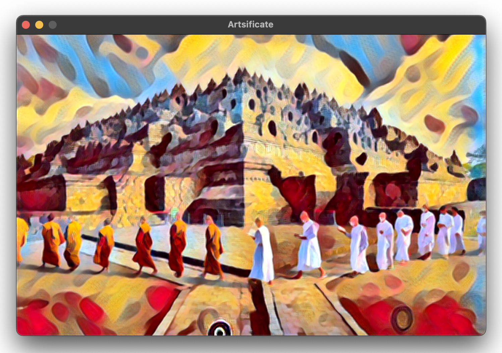
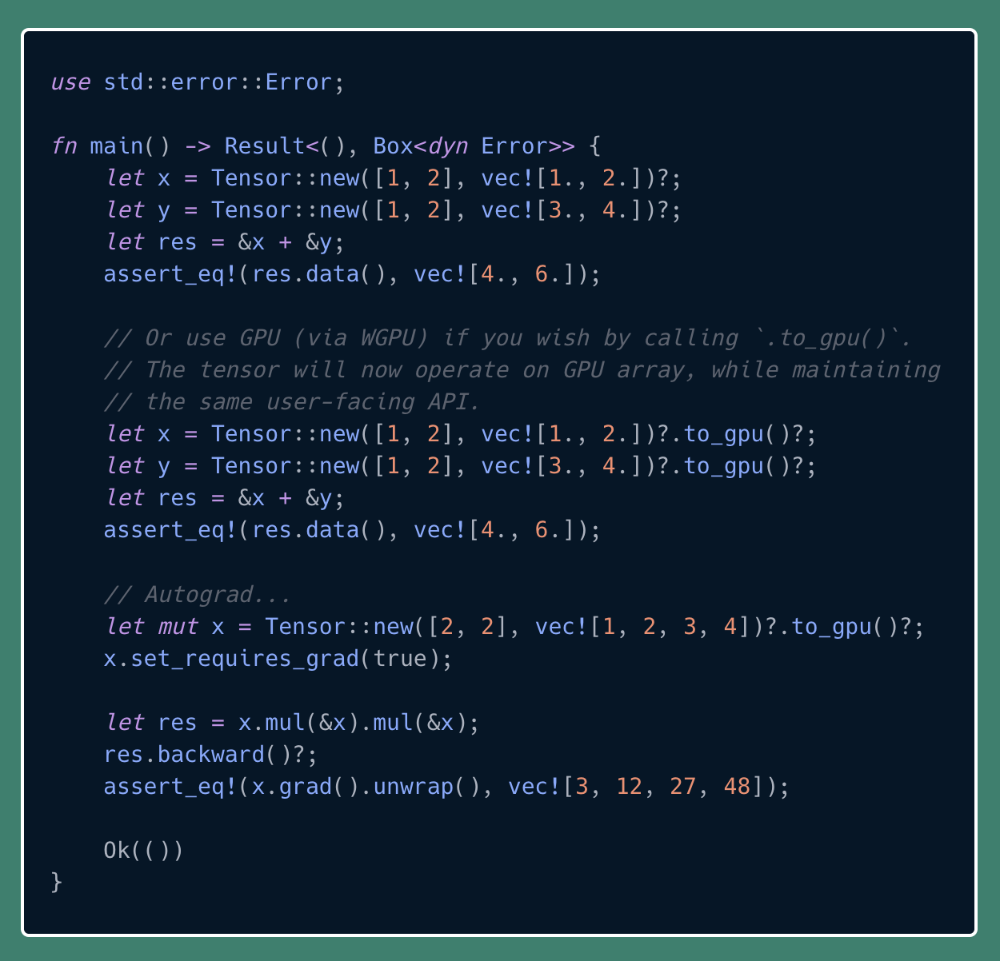

# Notable projects I built

## Mint

A single-header file only library, minimalist tensor library in pure C
from scratch with no dependency other than C standard libs. Optionally
it can be linked with BLAS, OpenMP, and NEON for further acceleration.
With the help of model export/importer, it can run a few of neural net
models, such as ResNet, style transfer, and YOLOv7.

[[Project link]](https://github.com/ariaghora/mint)

A single and small executable app for neural style transfer, built with Mint and Raylib

## Arnab

Arnab aims to provide simple yet portable solutions to organize and to
execute data models. This is inspired by DBT but is with subset of DBT
features, jinja-less (except the macros), theoretically more portable.

Its main purpose is simple: give it a directory with SQL files, it can
scan the directory recursively, and then determine the execution order
of all queries. The execution backend is the blazingly fast™ DuckDB.

[[Project link]](https://github.com/ariaghora/arnab)

<iframe width="100%" height="420px" src="https://www.youtube.com/embed/CwmvRuyRLy8" title="Arnab demo 1" frameborder="0" allow="accelerometer; autoplay; clipboard-write; encrypted-media; gyroscope; picture-in-picture; web-share" referrerpolicy="strict-origin-when-cross-origin" allowfullscreen></iframe>

Arnab demo for simple data transformation pipeline

## Tensoria

Experimental WGPU-accelerated ndarray written in rust. Tensoria offers
as easy API as possible. It provides automatic gradient computation or
autograd. It also allows creation of tensors with arbitrary dimensions
at runtime with ergonomic API.

[[Project link]](https://github.com/ariaghora/tensoria)

Tensoria example

## More projects

Please check [my github](https://github.com/ariaghora?tab=repositories&q=&type=&language=&sort=stargazers) to see more of my public projects.
